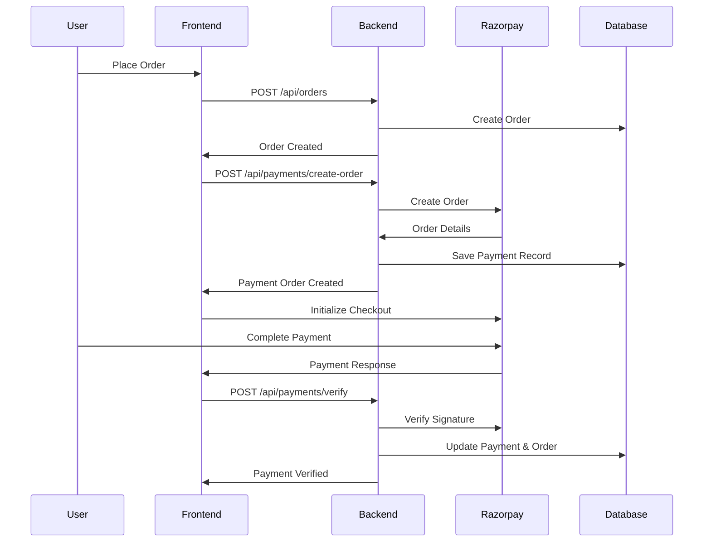

# Razorpay Payment Integration Setup Guide

This guide will help you set up and use the Razorpay payment integration in your Yuca Lifestyle backend.

## 🚀 Quick Start

### 1. Get Razorpay Credentials

1. Sign up at [Razorpay Dashboard](https://dashboard.razorpay.com/)
2. Go to **Settings** → **API Keys**
3. Generate **Test Keys** for development
4. Copy your `Key ID` and `Key Secret`

### 2. Environment Setup

Create a `.env` file in your backend directory with the following variables:

```env
# Database
MONGO_URI=mongodb://localhost:27017/yuca_lifestyle

# JWT
JWT_SECRET=your_jwt_secret_key_here
JWT_EXPIRE=30d

# Server
NODE_ENV=development
PORT=5001

# Razorpay Configuration
RAZORPAY_KEY_ID=rzp_test_your_key_id_here
RAZORPAY_KEY_SECRET=your_key_secret_here

# Frontend URL
FRONTEND_URL=http://localhost:3000
```

### 3. Test the Integration

Run the test script to verify your setup:

```bash
cd backend
node scripts/testPayment.js
```

## 📁 Files Created

The following files have been added to your backend:

### Models
- `models/Payment.js` - Payment database model

### Controllers
- `controllers/paymentController.js` - Payment logic and Razorpay integration

### Routes
- `routes/paymentRoutes.js` - Payment API endpoints

### Middleware
- `middleware/validators/paymentValidator.js` - Input validation

### Configuration
- `config/razorpay.js` - Razorpay SDK configuration and utilities

### Documentation
- `docs/PAYMENT_API.md` - Complete API documentation
- `payment-api.postman_collection.json` - Postman collection for testing

### Scripts
- `scripts/testPayment.js` - Integration test script

## 🔧 API Endpoints

| Method | Endpoint | Description | Auth Required |
|--------|----------|-------------|---------------|
| POST | `/api/payments/create-order` | Create payment order | ✅ |
| POST | `/api/payments/verify` | Verify payment | ✅ |
| GET | `/api/payments/:id` | Get payment details | ✅ |
| GET | `/api/payments/user/payments` | Get user payments | ✅ |
| GET | `/api/payments/status/:razorpayOrderId` | Get payment status | ✅ |
| POST | `/api/payments/refund` | Create refund | ✅ (Admin) |

## 💳 Payment Flow



## 🧪 Testing

### Using Postman

1. Import the `payment-api.postman_collection.json` file
2. Set your JWT token in the collection variables
3. Run the requests in sequence

### Using cURL

```bash
# Create payment order
curl -X POST http://localhost:5001/api/payments/create-order \
  -H "Authorization: Bearer YOUR_JWT_TOKEN" \
  -H "Content-Type: application/json" \
  -d '{"orderId": "ORDER_ID_HERE"}'
```

### Frontend Integration

```javascript
// Install Razorpay SDK
npm install razorpay

// Initialize payment
const options = {
  key: process.env.REACT_APP_RAZORPAY_KEY_ID,
  amount: paymentData.amount,
  currency: paymentData.currency,
  name: "Yuca Lifestyle",
  order_id: paymentData.razorpayOrderId,
  handler: async (response) => {
    // Verify payment
    await verifyPayment(response);
  }
};

const razorpay = new window.Razorpay(options);
razorpay.open();
```

## 🔒 Security Features

- **JWT Authentication**: All endpoints require valid tokens
- **Signature Verification**: Payment signatures are cryptographically verified
- **User Authorization**: Users can only access their own payments
- **Input Validation**: All inputs are validated and sanitized
- **Admin Protection**: Refund operations require admin privileges

## 📊 Database Schema

### Payment Model
```javascript
{
  order: ObjectId,           // Reference to Order
  user: ObjectId,            // Reference to User
  razorpayOrderId: String,   // Razorpay order ID
  razorpayPaymentId: String, // Razorpay payment ID
  razorpaySignature: String, // Payment signature
  amount: Number,            // Amount in rupees
  currency: String,          // Currency (default: INR)
  status: String,            // Payment status
  paymentMethod: String,     // Payment method used
  receipt: String,           // Receipt ID
  refunds: Array,            // Refund records
  createdAt: Date,
  updatedAt: Date
}
```

### Order Model (Updated)
```javascript
{
  // ... existing fields
  paymentMethod: String,     // Payment method
  paymentStatus: String,     // Payment status
  paymentId: ObjectId,       // Reference to Payment
  shippingAddress: Object,   // Shipping details
}
```

## 🚨 Error Handling

The API returns appropriate HTTP status codes:

- `400`: Bad Request (validation errors)
- `401`: Unauthorized (invalid/missing token)
- `403`: Forbidden (insufficient permissions)
- `404`: Not Found (payment/order not found)
- `500`: Internal Server Error (server issues)

## 🔄 Refund Process

1. Admin calls `/api/payments/refund` with payment ID
2. System creates refund with Razorpay
3. Payment and order status are updated
4. Refund record is stored in database

## 📝 Notes

- **Test Mode**: Use test keys (starting with `rzp_test_`) for development
- **Live Mode**: Switch to live keys for production
- **Amounts**: All amounts are stored in paise (smallest currency unit)
- **Webhooks**: Consider implementing webhooks for real-time updates
- **Logging**: All payment operations are logged for audit

## 🆘 Troubleshooting

### Common Issues

1. **"Razorpay not initialized"**
   - Check your environment variables
   - Ensure credentials are correct

2. **"Invalid signature"**
   - Verify your key secret
   - Check the signature generation logic

3. **"Order not found"**
   - Ensure the order exists
   - Check user authorization

4. **"Payment already verified"**
   - Payment can only be verified once
   - Check payment status before verification

### Getting Help

- Check the [Razorpay Documentation](https://razorpay.com/docs/)
- Review the API documentation in `docs/PAYMENT_API.md`
- Run the test script to verify your setup
- Check server logs for detailed error messages

## 🎯 Next Steps

1. Set up your Razorpay account and get credentials
2. Add credentials to your `.env` file
3. Test the integration using the provided scripts
4. Integrate with your frontend application
5. Set up webhooks for real-time updates (optional)
6. Switch to live mode for production

Happy coding! 🚀
